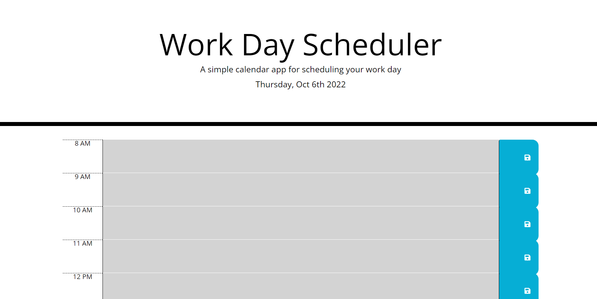
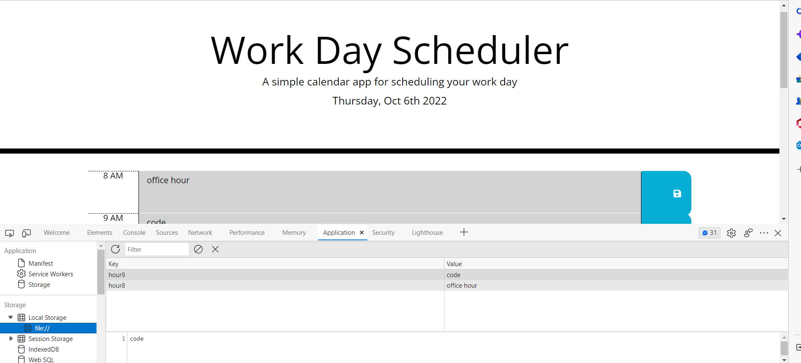

# Work-Day-Scheduler

# Description

Javascript is used by programmers across the world to create dynamic and interactive web content like applications and browsers. JavaScript is so popular that it's the most used programming language in the world, used as a client-side programming language by 97.0% of all websites

a simple calendar application that allows a user to save events for each hour of the day. It runs in the browser and feature dynamically updated HTML and CSS powered by jQuery.

The Webpage can easily access through this link[https://akash2040.github.io/Work-Day-Scheduler/]

# Table of Content

1. [HomePage](#homepage)
2. [Features](#features)
3. [CodeSnippet](#codesnippet)
4. [Tools](#tools)
5. [Prerequisites](#prerequisites)
6. [AuthorLinks](#authorlinks)

# HomePage




# Features

- the current day is displayed at the top of the calendar
- I am presented with time blocks for standard business hours
- I view the time blocks for that day
- the text for that event is saved in local storage

# CodeSnippet

```Display today's day and date
var todayDate = moment().format('dddd, MMM Do YYYY');
$("#currentDay").html(todayDate);

$(document).ready(function () {
    // saveBtn click listener
    $(".saveBtn").on("click", function () {
        // Get nearby values of the description in JQuery
        var text = $(this).siblings(".description").val();
        var time = $(this).parent().attr("id");

        // Save text in local storage
        localStorage.setItem(time, text);
    })

```

```Get item from local storage if any
    $("#hour8 .description").val(localStorage.getItem("hour8"));
    $("#hour9 .description").val(localStorage.getItem("hour9"));
    $("#hour10 .description").val(localStorage.getItem("hour10"));
    $("#hour11 .description").val(localStorage.getItem("hour11"));
    $("#hour12 .description").val(localStorage.getItem("hour12"));
    $("#hour13 .description").val(localStorage.getItem("hour13"));
    $("#hour14 .description").val(localStorage.getItem("hour14"));
    $("#hour15 .description").val(localStorage.getItem("hour15"));
    $("#hour16 .description").val(localStorage.getItem("hour16"));
    $("#hour17 .description").val(localStorage.getItem("hour17"));

    timeTracker();
```

# Tools

1. VsCode
2. Git (windows)
3. Github

# Prerequisites

Software need to be install

- Vscode
- git
- github(clone project)

# AuthorLinks

[Github](https://github.com/akash2040/Work-Day-Scheduler)
